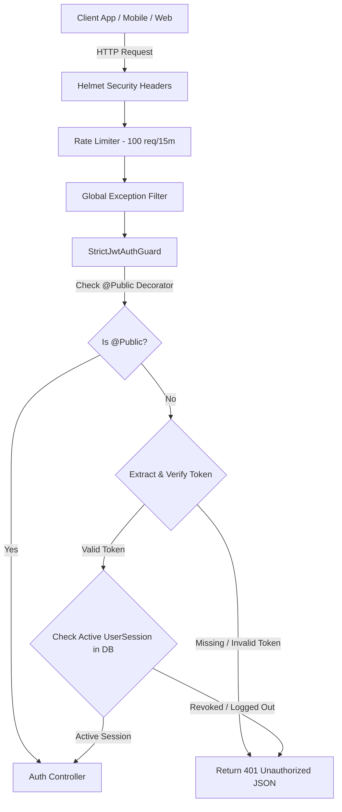

# Complete Code Review & Technical Documentation - BOI LAGBE Auth & Security Architecture

This document provides a comprehensive technical review of the production-ready Authentication and SaaS Zero-Trust Security Module built for **BOI LAGBE**.

---

## Table of Contents
1. [Architecture Overview & Technology Stack](#1-architecture-overview--technology-stack)
2. [Database Layer (TypeORM & Neon PostgreSQL)](#2-database-layer-typeorm--neon-postgresql)
3. [Global Security & Middlewares](#3-global-security--middlewares)
4. [Authentication Logic & Business Functions](#4-authentication-logic--business-functions)
5. [JWT & Cookie Management Strategy](#5-jwt--cookie-management-strategy)
6. [API Route Reference & Security Matrix](#6-api-route-reference--security-matrix)

---

## 1. Architecture Overview & Technology Stack

- **Framework**: NestJS (v11)
- **Database**: Neon Cloud PostgreSQL via TypeORM
- **Security Standard**: SaaS Zero-Trust (Strict 401 Enforcement, Session Revocation, Rate Limiting, HTTP Security Headers, Signed HTTP-Only Cookies)

---

## 2. Database Layer (TypeORM & Neon PostgreSQL)

We implemented **16 core entities** in `src/auth/entities/` mapping the complete user identity, profile, preferences, security, audit history, and support ecosystem.

### Entity Summary & Rationale

| # | Entity File | Table Name | Purpose & Rationale | Key Fields & Enums |
|---|---|---|---|---|
| 1 | `user.entity.ts` | `users` | Core user identity table. Primary entry point for all system roles (Student, Admin, Agent, Rider, Support). | `userCode`, `email`, `phone`, `password`, `roles` (`string[]`), `status` (`ACTIVE`, `SUSPENDED`, `BLOCKED`) |
| 2 | `user-profile.entity.ts` | `user_profiles` | 1:1 metadata extension for personal profile details. Keeps core `users` table lightweight. | `profilePhoto`, `dateOfBirth`, `gender`, `bloodGroup`, `bio`, `facebook`, `linkedin` |
| 3 | `student-profile.entity.ts` | `student_profiles` | 1:1 dedicated profile for users with `STUDENT` role. | `studentId`, `instituteId`, `campusId`, `departmentId`, `batch`, `rollNumber` |
| 4 | `user-address.entity.ts` | `user_addresses` | 1:N address repository for deliveries & shipping. | `addressType` (`HOME`, `HOSTEL`, `CAMPUS`, `OFFICE`, `OTHER`), `receiverName`, `receiverPhone`, `road`, `house`, `isDefault` |
| 5 | `user-device.entity.ts` | `user_devices` | 1:N device tracking for push notifications & login security audits. | `deviceId`, `deviceName`, `deviceType` (`ANDROID`, `IOS`, `WEB`, `WINDOWS`, `MAC`), `pushToken`, `ipAddress` |
| 6 | `user-session.entity.ts` | `user_sessions` | 1:N active session manager. Used for immediate session revocation and token tracking. | `accessToken`, `refreshToken`, `expiresAt`, `status` (`ACTIVE`, `EXPIRED`, `LOGGED_OUT`) |
| 7 | `user-otp.entity.ts` | `user_otps` | 1:N OTP verification repository with expiration and rate limiting attempt counters. | `otp`, `purpose` (`REGISTER`, `LOGIN`, `PASSWORD_RESET`, `CHANGE_PHONE`, `CHANGE_EMAIL`), `attemptCount`, `status` (`PENDING`, `VERIFIED`, `EXPIRED`) |
| 8 | `user-token.entity.ts` | `user_tokens` | 1:N long-lived or transactional tokens (password resets, email verifications). | `token`, `tokenType` (`EMAIL_VERIFY`, `PASSWORD_RESET`, `REFRESH_TOKEN`, `API_TOKEN`), `expiresAt`, `usedAt` |
| 9 | `user-login-history.entity.ts` | `user_login_histories` | 1:N compliance audit trail recording all login attempts, IP addresses, and user-agents. | `ipAddress`, `browser`, `operatingSystem`, `loginTime`, `logoutTime`, `status` |
| 10 | `user-security.entity.ts` | `user_securities` | 1:1 account security tracker to prevent brute-force attacks. | `twoFactorEnabled`, `failedLoginAttempt`, `accountLocked`, `passwordChangedAt` |
| 11 | `user-preference.entity.ts` | `user_preferences` | 1:1 localization & UI settings per user. | `language`, `currency`, `theme`, `timezone` |
| 12 | `user-notification-setting.entity.ts` | `user_notification_settings` | 1:1 notification preference toggles. | `pushNotification`, `emailNotification`, `smsNotification`, `marketingNotification` |
| 13 | `user-identity-verification.entity.ts` | `user_identity_verifications` | 1:1 KYC & agent/rider identity verification documents. | `documentType` (`NID`, `PASSPORT`, `STUDENT_ID`, `DRIVING_LICENSE`), `documentNumber`, `frontImage`, `verificationStatus` (`PENDING`, `APPROVED`, `REJECTED`) |
| 14 | `user-attachment.entity.ts` | `user_attachments` | 1:N generic file attachments linked to user account. | `fileName`, `fileType`, `fileUrl`, `fileSize` |
| 15 | `user-activity.entity.ts` | `user_activities` | 1:N audit logs for critical actions (e.g., password change, PDF download, order placement). | `activity` (`REGISTER`, `LOGIN`, `LOGOUT`, `PROFILE_UPDATED`, etc.), `ipAddress`, `referenceId` |
| 16 | `support-ticket.entity.ts` | `support_tickets` | 1:N support ticket system tied directly to user account. | `ticketNumber`, `category`, `priority`, `subject`, `description`, `status` (`OPEN`, `RESOLVED`, `CLOSED`) |

---

## 3. Global Security & Middlewares

All global security components are configured in `src/main.ts` and `src/app.module.ts`:

### A. `helmet()` (`main.ts`)
- **Why it was used**: Protects the server against common web vulnerabilities by setting security HTTP headers (XSS Filter, HSTS, X-Frame-Options, Content Security Policy).

### B. `rateLimit()` (`main.ts`)
- **Why it was used**: Prevents brute-force login attacks and Denial-of-Service (DDoS) by restricting IPs to a maximum of 100 requests per 15-minute window.

### C. `GlobalHttpExceptionFilter` (`src/common/filters/global-exception.filter.ts`)
- **Why it was used**: Catches all errors (400, 401, 403, 404, 500) across the entire app and standardizes them into a clean JSON response format.

### D. `StrictJwtAuthGuard` (`src/auth/guards/strict-jwt-auth.guard.ts`)
- **Why it was used**: Operates as a global `APP_GUARD`. It enforces **Zero-Trust Security**:
  1. Checks if the endpoint is decorated with `@Public()`. If yes, allows access.
  2. If not public, extracts JWT token from `req.cookies['access_token']` or `Authorization: Bearer <token>`.
  3. If token is missing or invalid, throws **HTTP 401 Unauthorized**.
  4. Queries `UserSession` table in Neon PostgreSQL to ensure the session is active. If logged out, throws **HTTP 401 Unauthorized**.

---

## 4. Authentication Logic & Business Functions

All core authentication business logic is located in `src/auth/auth.service.ts`:

### 1. `register(dto: RegisterDto)`
- **Purpose**: Creates a new user account.
- **Why & How**:
  - Validates uniqueness of phone number and email.
  - Hashes password using `bcrypt` (10 rounds).
  - Uses a **TypeORM QueryRunner Transaction** to atomically create `User`, `UserProfile`, `StudentProfile` (if role includes `STUDENT`), `UserSecurity`, `UserPreference`, `UserNotificationSetting`, and `UserActivity`. If any sub-profile fails, all changes rollback safely.

### 2. `login(dto: LoginDto, req: Request)`
- **Purpose**: Authenticates user credentials and issues session tokens.
- **Why & How**:
  - Finds user by email or phone.
  - Checks if `accountLocked` is true in `UserSecurity`.
  - Verifies password with `bcrypt.compare`.
  - Increments `failedLoginAttempt` on wrong password; locks account when attempts >= 5.
  - Records `UserLoginHistory` (IP address, user-agent).
  - Creates a new `UserSession` record in database with status `ACTIVE`.
  - Generates Access Token (15m) and Refresh Token (7d).

### 3. `sendOtp(dto: SendOtpDto)` & `verifyOtp(dto: VerifyOtpDto)`
- **Purpose**: Sends 6-digit OTP codes and verifies them for phone registration/verification.
- **Why & How**:
  - Saves code in `user_otps` table with 5-minute expiration (`expiresAt`).
  - Verifies OTP code, updates `attemptCount`, sets status to `VERIFIED`, and sets `isVerified = true` on `User`.

### 4. `refreshToken(userId, sessionId, oldRefreshToken)`
- **Purpose**: Issues a new token pair without requiring re-login.
- **Why & How**:
  - Validates `sessionId` in `user_sessions` table.
  - Verifies old refresh token signature.
  - Rotates tokens (replaces old tokens in DB with newly generated tokens).

### 5. `logout(userId, sessionId)`
- **Purpose**: Logs out user and revokes active session.
- **Why & How**:
  - Updates `UserSession` status to `LOGGED_OUT` and sets `logoutAt = new Date()`.
  - Clears `access_token` and `refresh_token` HTTP-Only cookies on response.

### 6. `getProfile(userId)`
- **Purpose**: Returns complete user details and all linked sub-profiles.
- **Why & How**:
  - Queries `User` table with `relations: { profile: true, studentProfile: true, addresses: true, security: true, preference: true, notificationSetting: true, identityVerification: true }`.
  - Strips `password` field from output object before returning.

---

## 5. JWT & Cookie Management Strategy

- **Access Token**: Short-lived (15 minutes). Transmitted via HTTP-Only, `SameSite=Strict` cookie named `access_token` (or `Authorization: Bearer` header).
- **Refresh Token**: Long-lived (7 days). Transmitted via HTTP-Only, `SameSite=Strict` cookie named `refresh_token`.
- **Security Benefits**:
  - **XSS Protection**: JavaScript running on client browser cannot access `document.cookie`.
  - **CSRF Protection**: `SameSite=Strict` prevents unauthorized cross-site requests.

---

## 6. API Route Reference & Security Matrix

Base Path: `http://localhost:3000/api/v1`

| Method | Endpoint | Security Level | Auth Required | Description |
|---|---|---|---|---|
| `POST` | `/auth/register` | Public (`@Public()`) | ❌ No | User & student profile registration |
| `POST` | `/auth/send-otp` | Public (`@Public()`) | ❌ No | Generates and sends OTP code |
| `POST` | `/auth/verify-otp` | Public (`@Public()`) | ❌ No | Validates 6-digit OTP |
| `POST` | `/auth/login` | Public (`@Public()`) | ❌ No | Validates credentials & sets HTTP-Only cookies |
| `POST` | `/auth/refresh-token` | Public + Refresh Guard | ⚠️ Refresh Token | Rotates expired access token |
| `POST` | `/auth/logout` | Protected (Zero-Trust) | ✅ Access Token | Revokes session & clears cookies |
| `GET` | `/auth/me` | Protected (Zero-Trust) | ✅ Access Token | Fetches complete user profile & sub-objects |
